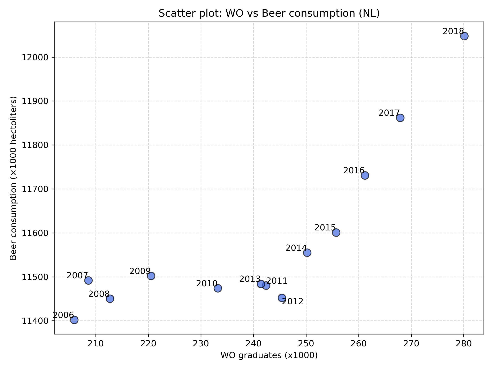

## Student ID

16460100

## Paper Titles

- **MCC Van Dyke et al., 2019**
  _Fantastic yeasts and where to find them: the hidden diversity of dimorphic fungal pathogens_
- **JT Harvey, Applied Ergonomics, 2002**
  _An analysis of the forces required to drag sheep over various surfaces_
- **DW Ziegler et al., 2005**
  _The neurocognitive effects of alcohol on adolescents and college students_

## Plot

## Interpretation

The scatter plot does show that as the number of WO gradutes increases over the years, the amount of beer consumption does also tend to increase. However this relationship is not strictly linear which does suggest that there are other factors outside of number of WO graduates that affect beer consumption levels
